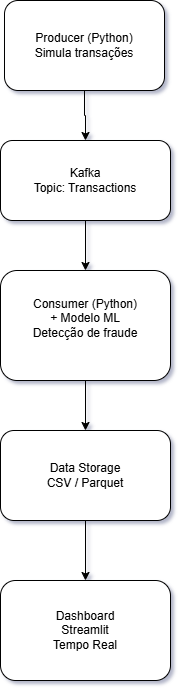
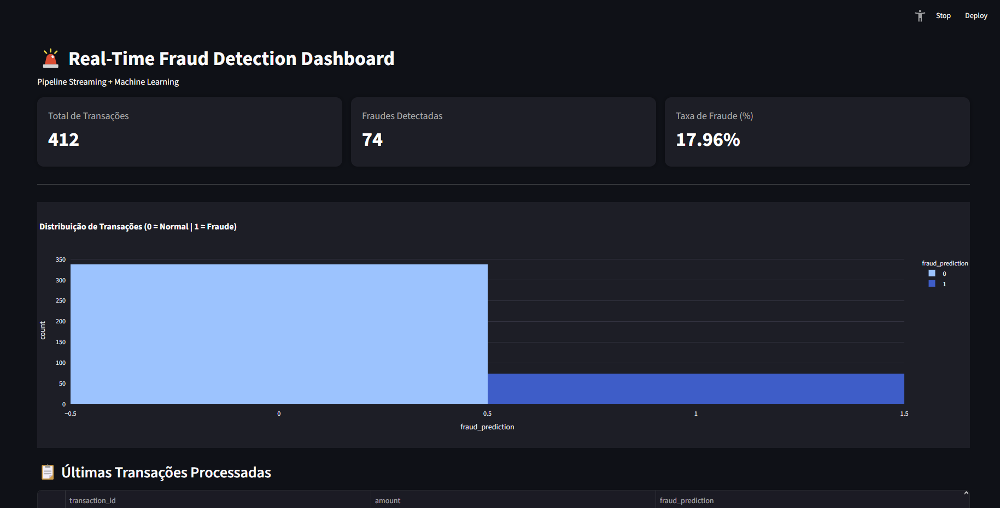

# 🚨 Real-Time Fraud Detection Pipeline

Este projeto implementa um pipeline completo de Engenharia de Dados com Machine Learning para detecção de fraudes em tempo real utilizando streaming de dados.

## 📌 Objetivo
Simular um sistema real de processamento de transações financeiras, aplicando um modelo de Machine Learning para classificar transações como normais ou fraudulentas e exibir os resultados em um dashboard interativo.

## 🏗️ Arquitetura

Producer (Python) → Kafka → Consumer (ML) → CSV/Storage → Streamlit Dashboard



## 📸 Screenshot



## ⚙️ Tecnologias utilizadas

- Python
- Apache Kafka
- Docker & Docker Compose
- Scikit-learn
- Pandas
- Streamlit
- Plotly

## 🔄 Funcionamento do Pipeline

1. O Producer gera transações financeiras simuladas em tempo real.
2. Os dados são enviados para um tópico Kafka.
3. O Consumer consome os dados e aplica um modelo de Machine Learning treinado.
4. Os resultados são salvos em arquivo CSV.
5. O Dashboard Streamlit lê os dados e exibe métricas e gráficos em tempo real.

## 📊 Dashboard

O dashboard apresenta:
- Total de transações processadas
- Quantidade de fraudes detectadas
- Taxa de fraude (%)
- Distribuição das classificações
- Últimas transações processadas

## 🚀 Como executar o projeto

```bash
docker-compose up -d
python producer/producer.py
python consumer/consumer_save.py
streamlit run dashboard/app.py
